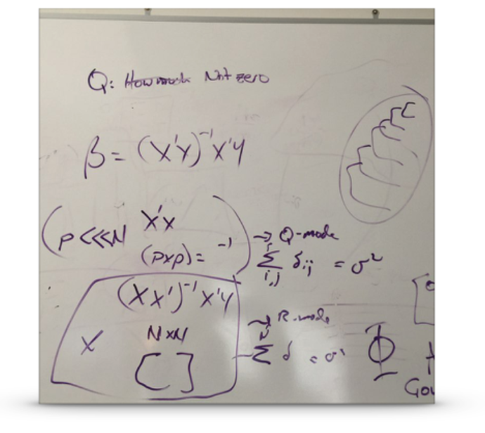

class: left, bottom
background-image: url("images/contour.png")
background-position: right
background-size: auto


# The R Environment


### Installation & Environment Configuration


<p>&nbsp;</p>

<p>&nbsp;</p>


---

class: sectionTitle

# Software 

```{r setup, include=FALSE}
knitr::opts_chunk$set( echo = TRUE,
                       fig.retina = 2, 
                       message = FALSE,
                       error = FALSE)
library(tidyverse)
theme_set( theme_minimal( base_size = 20))
library(DT)
```


---
# Analytical Platforms - Old School

.pull-left[
- Mastery required *a priori*  

- Limitless (mostly)  

- Steep learning curve  
]

.pull-right[

]


---
# Analytical Platforms - Point & Click

.pull-left[

- Mastery through discovery (*what does this do?

- Only supporting the most common implementations  

- Expansion boundaries

- Tied to closed-source corporation
]

.pull-right[

]


---
# Analytical Platforms - Analytical Languages

.pull-left[
- Generalized Tools

- Expandable by the User


- Lower "barrier to entry"

- Useful across many domains.
]

.pull-right[

]

---

class: sectionTitle

# Why Analytical Languages


---
class: center middle


---

# It all started...

> Date: Wed, 4 Aug 93 14:01:31 NZS  
> From: Ross Ihaka   
> To: S-news@utstat.toronto.edu  
> Subject: Re: Is  S  available for a Macintosh personal computer?  
> 
> Joseph B Kruskal writes:
> 
> > If anyone knows of an S available for a Macintosh computer, I
> would be pleased to hear about it. 
> 
> About a year ago Robert Gentleman and I considered the problem of
> obtaining decent statistical software for our undergraduate
> Macintosh lab.  After considering the options, we decided that
> the most satisfactory alternative was to write our own.  We
> started by writing a small lisp interpreter.  Next we expanded
> its data structures with atomic vector types and altered its
> evaluation semantics to include lazy evaluation of closure
> arguments and argument binding by tag as well as order.  Finally
> we added some syntactic sugar to make it look somewhat like S.
> We call the result "R".


---
class: center middle

```{r echo=FALSE}
data <- read.csv( text = "Language,Year,Label
                  S,1975,Bell Laboratories Version 1.0
                  S,1980,Release Outside Bell Labs
                  S,1984,Education & Commercial Licensing
                  S,1988,Statiscal Software Inc.
                  S,1993,Mathsoft Buys S
                  S,1995,Version 3.3
                  S,1996,Version 3.4
                  S,1997,Version 4.0
                  S,1999,Version 5.0
                  S,2000,Version 6.0
                  S,2002,Free Student Version
                  S,2005,Version 7.0
                  S,2007,Version 8.0
                  S,2015,TIBCO
                  R,1995,Unstable
                  R,1997,Version 0.49
                  R,1999,Version 0.65 CRAN & Packages
                  R,2000,Version 1.0
                  R,2001,Version 1.4 S4
                  R,2004,Version 2.0
                  R,2013,Version 3.0
                  R,2017,Version 3.4
                  R,2018,Version 3.5")

data$Y <- c( 0.1, 0.2, 0.3, 0.3, 0.5, 0.55, 0.5, 0.45, 0.5, 0.4, 0.3, 0.2, 0.1, 0.1,
             -0.3, -0.3, -0.3, -0.25, -0.2, rep(-0.3, times=3), 0.25 )
data$ymax <- c( data$Y[1:14], rep(0,9))
data$ymin <- c( rep(0,14), data$Y[15:23])
data$angle <- c( rep(45,14), rep(-43,9) )
data$hjust <- c( rep(0,14), rep(0, 9))
ggplot( data, aes(Year,Y,label=Label) ) + 
  geom_linerange( aes(ymin=ymin,ymax=ymax) ) +
  geom_text( aes( color=Language, angle=angle, hjust=hjust), vjust=0, size=3) +
  geom_hline(yintercept=0,color = "black", size=0.3) + 
  geom_point( aes(y=0, color=Language), size=3) + 
  scale_color_manual( values=c("#0070C0", "#00B050") ) + 
  theme_classic(base_size = 20) + ylim(c(-1,1.4) ) + xlim( c(1975,2021) ) + 
  xlab("Year") + 
  theme( axis.line.y=element_blank(),
                axis.text.y=element_blank(),
                axis.title.x=element_blank(),
                axis.title.y=element_blank(),
                axis.ticks.y=element_blank(),
                legend.position = "none" ) -> p


print(p)
```


---

# Community Input

`R` is designed to be extensible.  This means that as people tackle different problems, they provide code solutions that others may also freely use.

.center[
<iframe src="https://cran.r-project.org/web/packages/available_packages_by_name.html" title="Packages available for R" width=700 height=400>
</iframe>
]


---

class: center middle


---
class: middle, center

```{r echo=FALSE}
suppressMessages( araptus <-  read_csv( "data/araptus.csv") )
datatable( araptus )
```


---

# Data & Narrative

The spatial distribution of $N =$ `r sum(araptus$Males) + sum(araptus$Females)` individuals were sampled from $K =$ `r nrow(araptus)` sampling sites covered the entire known extent for *Araptus attenuatus* (Figure 1).  On average the sex ratio (Females:Males) within each of the sampling locales varied considerably, ranging from a low of `r format(min( araptus$Females / araptus$Males ), digits=3)` to `r format(max( araptus$Females / araptus$Males ), digits=3)`.

--

```{r echo=FALSE}
model <- glm( (Females / Males) ~ log(Suitability), 
              data = araptus,
              family = Gamma() )
```


Female beetles seem to be selecting locales in more suitable habitats (Figure 2), which is consistent with a Gaussian log normal distribution (GLM; intercept = `r format(summary(model)$coefficients[1,1], digits=3)`; coef =`r format(summary(model)$coefficients[2,1], digits=3)`; P =`r format(summary(model)$coefficients[2,4], digits=3)`)..  This suggests that males who establish brood chambers at the margins of the species niche are actively selected against by maturing females.

---
class: center middle

```{r echo=FALSE}
library(leaflet) 

leaflet(data = araptus) %>%
  addProviderTiles(provider="Stamen.TerrainBackground") %>%
  addCircleMarkers(weight=1, fill=TRUE, color="#fff") %>%
  addLabelOnlyMarkers(label=~as.character(Site), 
                      labelOptions = labelOptions(noHide=TRUE,
                                                  direction='center',
                                                  textOnly = TRUE))


```


---

class: center middle

```{r echo=FALSE}
araptus %>%
  ggplot( aes(Suitability, (Females / Males)) ) + 
  geom_smooth(formula = y ~ log(x), 
              method=glm, 
              se=FALSE, 
              color="red",
              size=0.5) +
  geom_point() +
  xlab("Habitat Suitability") +
  ylab("Observed Sex Ratio (F/M)") +
  xlim( c(0,1) ) + ylim(c(0.25,1.75))
```


---

# Getting R

The canonical location for R is [CRAN](https://cran.r-project.org), which is the main site but has [mirrors](https://cran.r-project.org/mirrors.html) sites located across the world.  

- Pick a site in close geospatial proximity to you.

- Download the installer for your platform (Mac, Windows, Linux)

- Follow the instructions on the installer for your particular platform.


---

# Sufficent R Version?

If you already have R installed on your computer, you may want to make sure it is up-to-date.  The last time these slides were compiled (they are written in R as well), the version was: 

```{r}
version$version.string
```

To ensure you are able to complete all the activites in this class, please have at least this version on your computer.


---

# Keeping Updated

If you have a relatively recent version, we can make sure that the packages you already have are also updated by giving the following command.

```{r}
update.packages(ask=FALSE)
```


---
class: center middle
# The Native `R` Interface


---
class: center middle
# R Via Terminal


---

class: sectionTitle

# RStudio 


---

# RStudio


[RStudio.com](https://rstudio.com)


---

# Using RStudio Cloud

[RStudio.cloud](https://rstudio.cloud)

---

class: center middle


---

# Tour of the Interface


RStudio is essentially a 4-paned browser.


---

class: middle
background-image: url("images/contour.png")
background-position: right
background-size: auto

.center[

# Questions?


]

<p>&nbsp;</p>

.bottom[ If you have any questions for about the content presented herein, please feel free to [submit them to me](https://docs.google.com/forms/d/e/1FAIpQLScrAGM5Zl8vZTPqV8DVSnSrf_5enypyp0717jG4PZiTlVHDjQ/viewform?usp=sf_link) and I'll get back to you as soon as possible, else you can [return](/prework/) to the class website.]


