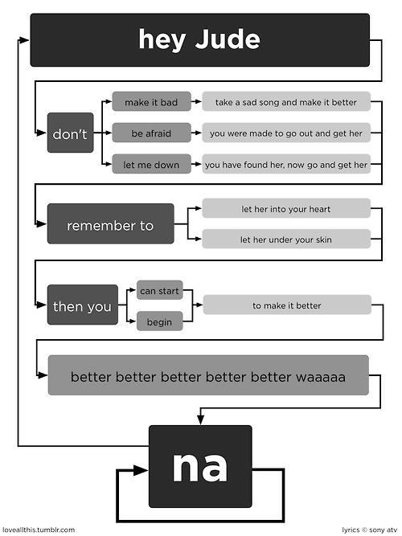

class: left, bottom
background-image: url("images/contour.png")
background-position: right
background-size: auto


# Character & String Data


### Working and Parsing Textual Content


<p>&nbsp;</p>

<p>&nbsp;</p>


---

class: sectionTitle

# Textual Represenations

---

# String & Character Data

One of the most fundamental kinds of data we work with is textual data.

- Population Names  

- Genetic Sequences

- Parsing Raw Files

- Automated Lexicographic Analyses


---

# Character Data Types

In `R`, string and character data is represented as a sequence of objects *enclosed* within either single or double quotes.


```{r}
"Dyer"
```


```{r}
'Rodney'
```

--  

Notice that you .red[must] use the same quote character to start and finish the data within the sequence.


---

# First Gotcha `r emo::ji("explode")`

RStudio ties to match quotes (e.g., when you open as string with a quote glyph, it automatically puts in the matching closing one for you).  However if this fails, RStudio will continue to accept input (forever) until you finish with the closed quote character.

--

```
> "Bob 
+ 
+ 
+ 
+ help()
+ 
+ 
+ 
+ o crap, what is happening?
+
```

The .red[dead] giveaway is the the plus sign that is automatically put into the next line on the console.


---

# Creating String Variables

In `R`, data is represented in *variables*, which is pretty handy so we do not need to type in a ton data each time we want to reference it.

```{r}
string1 <- "DEQ R Training is the best!"
```

--

Variable names should:

- Be unique  

- Start with a character  

- Contain letters, numbers, and some symbols (e.g., `_`, `.`)

- Unless transient, it should .red[describe the data it is representing]


---

# The Assignment Operator `<-` (or `->`)

To assign values to a variable, we use either the left or right *assignment operator* consisting of a dash and a less than or greater than symbol.  Yes it is two symbols combined together (and in fact can point in either direction and have one or two of the *-than signs)

```{r}
x <- "Bob"
x
"Alice" -> y
y
```


---

# Why not the =?

The grammar of `R` (neé `S`) was defined using assignment as a .red[directional] operator to help *readability*.   The equals sign is non-directional.


--

In some cases you could use `=` in place of `<-` but it will not work properly .red[all the time].  For example if you look at `?Syntax`, the *Order of Operations* for assignment is different, with the equals sign below that of either `->` and `<-`

```
-> ->>  Rightwards Assignment
<- <<-  Leftwards Assignment
=       Assignment (Right to Left)
```

This means that as things become more complex (which we will soon jump into), you can get some grammatical and logical errors if you .red[incorrectly insist] on using `=` instead of either `<-` or `->` for assignment.


---

# Equality Operator

While we are here with the equals sign, let's jump onto the issue of equality (e.g., testing to see if the data pointed by two or more variables are equal).  This is done by using .red[two equals signs].<sup>1</sup>

```{r}
x == y
```

-- 

For inequality, we use this.

```{r}
y != x
```


.footnote[<sup>1</sup>This is another reason why we do not use `=` for assignment, it is just too easy to have a typo when you were intending to ask `y = 42` (assignment) vs `y == 42` (test of equality).]


---

# Functions: Operations On Variables

.pull-left[

The purpose of `functions` are to *encapsulate* a bunch of code.  

```{r plot-label, eval=FALSE}


# Make some random data
N <- 100 
x <- rnorm( N )
y <- rnorm( N )

# Plot it in a scatter plot
plot( x, y )
```

Consider how many things need to happen to make a simple scatter plot between two sets of random numbers.  The function `rnorm()` provides a set of random numbers drawn from a normal distribution with mean $0$ and variance $1$.
]

.pull-right[

```{r plot-label-out, ref.label="plot-label", echo=FALSE}
```
]


---

# Operations on Variable

We can apply `functions` to variables (or to nothing) that do operations for us.  The form a function is 

```
functionName( varible1, variable2, ...)
```

--

The name of the function come first followed by zero or more variables **within** parentheses—each separated by a comma.<sup>1</sup>

- Functions provide a nice way for us to **encapsulate** code that does stuff for us (often over and over to make our lives enjoyable).

- To find out about the function, you can use the *Help* pane in `RStudio` or in the console type `?functionName` and it will show the help file for you.

- `r emo::ji("warning")` Please make sure there is no space between the end of the name of the function and the opening parenthesis!

.footnote[<sup>1</sup>The ellipsis is for additional stuff to be added if present and is used to allow the user to pass additional information to *downstream* operations.]


---

# Investigating Contents of String Variables `r emo::ji("thinking")`

There are times when we need to figure out properties of characters within a string object.


```{r}
NedPlimptonsOtherName <- "Kingsley"
NedPlimptonsOtherName
```

&nbsp;

```{r}
# Number of characters in the data pointed to by the variable NedPlimptonsOtherName
nchar( NedPlimptonsOtherName )
```

.footnote[Programmers are .red[lazy] and whenever we can do something that allows us to type fewer characters, we will do it.  This reduces the opportunity for us screwing up and introducing errors into our code.]


---
class: reveal 

# Special 'Escaped' Characters

There are some keys on your keyboard that have some special meaning that cannot be represented by a single *glyph* in a text file.  There are various ways to display these.


RStudio + Keyboard Input

- Tab character (ascii keyboard input): ⇥ 

- New Line (Carriage Return + Line Feed; ascii keyboard input as well): ↲

- ASCII Escaped Characters (backslash escaping of special characters): ¯\\\_(ツ)\_/¯

&nbsp;

`R` Interpreted Input

- Greek and Latin Symbols (keyboard combinations or unicode): `r "\u00b5"`

- Emoji (yes, there is a library to insert the poop emoji): `r emo::ji("poop")`


---

# Quoting Quotes

There are times that you need to actually use a quote character in our output.  To do this, we use the backslash escape.

```{r}
x <- "\""
x
```

--

By default, `R` will show you the escaped version as normal `R` code.  However, if you want to write it out as it would be if we saved it to a file, you can use the `writeLines()` function (the same applies for [unicode](https://unicode-table.com/en/) stuff).

```{r}
writeLines(x)
writeLines("\u2665")
```


---

# Concatenating String Objects - Your First Function `r emo::ji("joy")`

The `c()` function is the first and shortest of built-in functions.  The purpose of this is to take more than one instance of a variable and concatenate them as a *vector*.

```{r}
names <- c( "Ned", "Plimpton")
names
```

--

To access them individually, we use square brackets `[` and `]` and a numerical index (beware these start counting at 1 you nascent python users).

```{r}
names[2]
names[3]
```

---

# Getting Help `r emo::ji("person tipping hand")`

All functions in R have a help file associated with it.  Looking at them can be very helpful... (see what I did there?).

To access the help file you can use the `?` operator prepended to the name of the function.  So to look at the `c()` function we just used, we would type into the console

```{r eval=FALSE}
?c
```

and the help page will come up.  If there are multiple versions of the function (from different packages), you must select one to see the help file.

---

# Contents of a Help File

All help files have the following sections:

- Name of the packages that owns it.  

- Description of the function  

- Usage of the function  

- Arguments that can be passed to the function

- A more in-depth discussion of the Details of the function.

- The Values that are returned by the function

--

- EXAMPLES  .red[<- The most useful part]


---

# Increasing Concatenation

You can subsequently add more items to a vector by assignemnt to existing entries

```{r}
names[1] <- "Kingsley"
names
```

--

Or to ones that are beyond the current range (a generally bad habit thought).

```{r}
names[4] <- "Zissou"
names
```

&nbsp;

`r emo::ji("warning")` There is a `NA` (which is missing data) in the 3<sup><u>rd</u></sup> position.


---

# Performance Recommendation 🏁

If you are going to work with large vectors, it is in your best interest to not incrementally concatenate data.

```
x <- "Bob"
x <- c( x, "Alice" )
x <- c( x, "Roger" )
...
```

--

The best way is to preallocate your data vector to the size you need it and then fill it in.  Depending upon the kind of variable you are using, it will put in the default `null` value for each entry.  Then as you need it, fill it in.

```{r}
x <- character( 12 )
x
```


---

# Lengths of Things `r emo::ji("ruler")`

We've already seen the `nchar()` function that gives the number of characters is a variable.

```{r}
names 
nchar( names )
```


--

But if we want the number of entries in the vector itself, we use `length()`.

```{r}
length( names )
```


.footnote[We will see shortly when we jump into using `stringr` that we can disambiguate these things a bit.]


---

# Built-In String Objects

There are some built-in variables that provide string objects for you.

```{r}
LETTERS
```


The `LETTERS` object in `R` is a *variable* that contains data (in this case a sequence of letters).


---

## 10 Minute Activity - Baby Steps with Strings

Create an R script file (`File -> New File -> R Script`) and save it as `character_data.R` in your project directory.  After each of the steps below, `Source` (e.g., hit the source button) the file and look at the output in the console.

1. Define a variables `first_name`, `middle_name`, `last_name` and fill them in with your own data.  What happened when you `Source`d the file?

2. List the names of the variables, one on each line (AFTER!!!!!) their definition.  What happened after the `Source` this time?

3. Put them into a variable named `me` that has them all together using the `c()` function (like we did for good old Ned) and on the next line put the name of this variable again.  What happened after this `Source`?

4. Look up the function `paste` in the help files using the command `?paste`.  If you are given a few options, select the one with the title *Concatenate Strings* that is provided in the *base* package.


---

class: sectionTitle

# Packages

### Extending Built-In Functionality with Someone Elses Efforts `r emo::ji("+1")`


---

# Packages

.pull-left[
Packages are collections of code that can include:

- Functions 

- Help files

- Example data

- Images

- Documentation

- Vignettes
]

--

.pull-right[

You can install packages by typing the command `install.packages()` into the console.  Let's install a package that allows you to insert emoji's (why not) and another that will do some more specific string operations because we are trying to be serious here.

The first packages is installed from Hadley's [Github](https://github.com/hadley/emo) repository and the second one is from the global [CRAN](https://cran.r-project.org) repository.

```{r eval=FALSE}
install.packages("stringr")
remotes::install_github("hadley/emo")
```

]


---

# Loading Packages

Now that they are installed on your computer, you need to tell `R` when you want to use them.  By default, they are not loaded into memory because there can literally be too many packages on your machine for the limited amount of RAM you have.  I currently have `r nrow(installed.packages())` different packages installed onto my laptop as I'm typing this.

To load them in, we use `library()`

```{r}
library(stringr)
```

Now all the functions in the `stringr` package are in memory.


---

# While We Are At It

While we are here, let's just do this once and get it over with.  Instead of loading in the individuals parts of tidyverse, let's just get in the habit of loading it all in at the beginning.  So to install all of tidyverse, 

```{r eval=FALSE}
install.packages("tidyverse")
```

Then when we start we can use:

```{r}
library( tidyverse )
```
To get everything in at the beginning so we don't have to worry about it later.


---

# Not Loading but Accessing

There are times (and we will be very aware of this when we get to working with spatial data) when the process of loading in a bunch of functions from a package can cause some problems.  This is especially an issue when the name of functions in two or more libraries are the same.  How is `R` supposed to know which one to use?

--

### Package Namespaces

What `R` has done is to create package namespaces that allow you to grab a function from a package without loading the whole package into memory.  To do this, we use the full package name and the function name connected by two colons (`::`).  

```
packageName::function()
```

--

For the Emoji library (`emo`), this was used exclusively since it was thought that you'd never actually want to load them all into memory.

```{r}
emo::ji("poop")
```


---

class: sectionTitle

# The `stringr` Library


---

# Exploring Package Functions

Each package must have a large amount of help files and documentation before CRAN allows it to be put on the global servers.  You can find it using the built-in help in RStudio or by using 

```{r eval=FALSE}
?stringr
```

or 

```{r eval=FALSE}
help.search("stringr")
```


---

# The Purpose of `stringr`

The `stringr` package is part of a constellation of packages known as `tidyverse` that focues on string operations.  

.pull-left[
> The tidyverse is an *opinionated* collection of R packages designed for data science. All packages share an underlying design philosophy, grammar, and data structures.
]

.pull-right[

]

Some of the functions in `stringr` replicate built-in functions but since we are going to use tidyverse explicitly in this class, we will skip over them—a problem with the built-in stuff is *inconsistency*, which is why tidyverse was created.


---

# Common Prefix

All of the functions in `stringr` start with `str_` as a prefix.  This is to help prevent *namespace collisions* as well as to make sure you are entirely confident that the functions you are using are the ones you think you are using.


---

# Length of String Objects

Since `length` is such a common characteristic, `str_length` is what `nchar` does but in a more consistent taxonomic context.

```{r}
str_length( names )
```

--

For the length of the vector, we still use `length()` as it is asking for the number of elements in the vector, **not** the length of the string elements within it.

```{r}
length( names )
```


.footnote[ See, this is much better than remembering `nchar` vs `lenght`.]

---

# Concatenating Strings

By default, concatenation is direct.

```{r}
str_c("Rodney","Dyer")
```

But there are times when we need to insert some character into the concatenation so it works

```{r}
str_c( "Rodney", "Dyer", sep = " ")
```

---

# Dropping Missing Values

Missing data is a fact of life.  In fact, "If you do not have missing data somewhere, you are not trying hard enough..." said my advisor once.  In `R`, all missing data is encoded as `NA` (which is actually a data type)

```{r}
names
```

--

It can be identified.

```{r}
is.na( names )
```


--

And replaced

```{r}
str_replace_na(names, replacement = "Ned")
```


---

# Vectorization

Since .red[a lot] of the work we do in `R` is on vectors of data, the functions must also be *vectorized*.

```{r}
myClasses <- str_c("ENVS", c(521, 543, 601, 602), sep="-" )
myClasses
```

--

Two Items of Interest here:

1. Notice how the prefix `ENVS` was merged into with each element of the class vector and the `sep` indicates the separator between them.

1. The numbers in the vector were converted (coerced) into character values directly.  Coercion is a one-directional monster and a string represenation of another data type is one of the lowest precidents.


---

# Collapsing = $\frac{1}{Vectorization}$

You can go the other way in this and take a vector of results and collapse them back into a single string.

```{r}
str_c( myClasses, collapse=", ")
```


---

# Grabbing Subsets 

Components within elements can be extracted using the numerical index of the first and last component of interest (n.b., both indices are inclusive).

```{r}
str_sub(myClasses, start = 6, end = 8) 
```

--

Counting backwards too (notice I also can drop the names of the non-data variables too - but **must** be given in the order displayed in the help file!).

```{r}
str_sub(myClasses, -3, -1) 
```

.red[Look mom, I'm going backwards 🤪 !]


---

# Splitting Strings

The `str_split()` function that takes an input string and pattern and produces divides it into individual components.


```{r}
bearded_dude_in_front <- "Rodney James Dyer"
str_split(bearded_dude_in_front, "James")
str_split(bearded_dude_in_front, " James ")
str_split(bearded_dude_in_front, " James ")[[1]]
```

--- 

# Case Manipulation

Often when we work with strings, we'll need to standardize the case.

```{r}
tolower( bearded_dude_in_front )
toupper( bearded_dude_in_front )
```


---
# Complicated String Operations

The last example I'll provide an example using several steps operations on a more complicated string.  Here is some example text from the DEQ webpage (the first paragraph on the "About" page).

Goal: Take the string below and find most common word.

```{r}
aboutDEQ <- "Responsible for administering laws and regulations related to air quality, water quality, water supply, renewable energy and land protection, DEQ is the environmental agency in the Commonwealth of Virginia. Through the work of nearly 800 employees at six regional offices across the state and the Central Office in Richmond, DEQ issues permits, conducts monitoring and inspections, and enforces the law."
```


---
# DE FACTO process for Any Data Analysis.

By far, the most time consuming component of any data analysis is taking the raw data and manipulating it into a form that is amenable to do an analysis.  **By far**, the time taken to run the analysis is miniscule compared to the time you will spend manipulating data to get it to be suitable for your needs.  
Our workflow.

1. Get data
2. Remove punctuation.
3. Make it lowercase
4. Split on the spaces to get all words.
5. Find counts

--

Create new R Script named `string_example.R` in the project directory and let's walk through how we can do this.


---


.pull-left[
## 15 Minute Activity - String Operations - Your Turn

Create a new R script (`File -> New File -> R Script`) and save it as `string_example_jude.R` in your project directory. 

Do the same analysis for the lyrics of *Hey Jude*, which can be found [here](https://raw.githubusercontent.com/dyerlab/ENVS-Lectures/master/data/hey_jude.txt)

Are here more "hey"s, "jude"s, or "na"s?

]
.pull-right[

]


---

class: middle
background-image: url("images/contour.png")
background-position: right
background-size: auto

.center[


]


