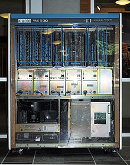
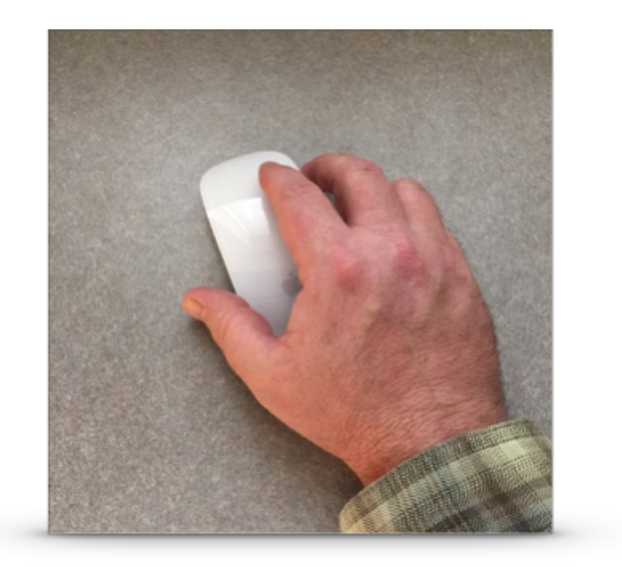
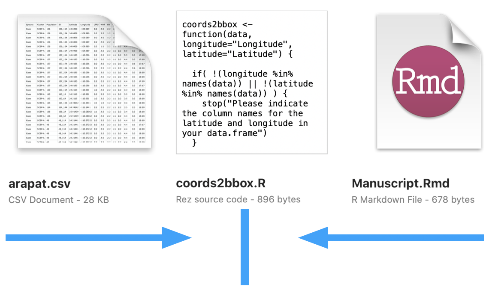
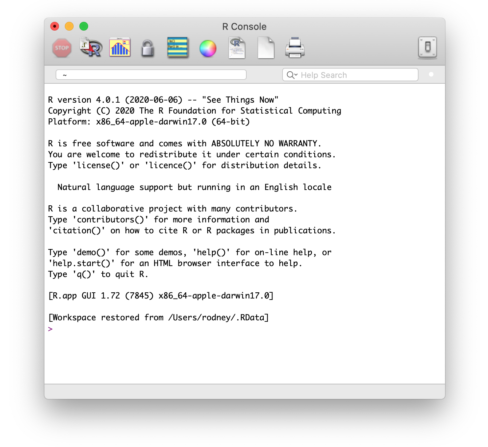

class: left, bottom
background-image: url("images/contour.png")
background-position: right
background-size: auto


# R Data Literacy


### Putting the .box-yellow[Fun] <br/>in Functional Programming


[Dr. Rodney J. Dyer](https://dyerlab.org)

<p>&nbsp;</p>

<p>&nbsp;</p>


---

class: sectionTitle

# Rationale 

```{r setup, include=FALSE}
knitr::opts_chunk$set( echo = TRUE,
                       fig.retina = 2, 
                       message = FALSE,
                       error = FALSE)
library(tidyverse)
library(leaflet) 
theme_set( theme_minimal( base_size = 20))
library(DT)
```


---
# Analytical Platforms - Old School

.pull-left[
- Mastery required *a priori*  

- Limitless (mostly)  

- Steep learning curve  
]

.pull-right[

]


---
# Slightly less 'Old School'


.pull-left[


### SAS on VAX
]

--
.pull-right[

### Greenbar printout for days!!!

]


---
# Analytical Platforms - Point & Click

.pull-left[

- Mastery through discovery (*what does this do?)

- Only supporting the most common implementations  

- Expansion boundaries

- Tied to closed-source corporation
]

.pull-right[

]


---
# Analytical Platforms - Analytical Languages

.pull-left[
- Generalized Tools

- Expandable by the User


- Lower "barrier to entry"

- Useful across many domains.
]

.pull-right[

]

---

class: sectionTitle

# Why Analytical Languages


---
class: center middle


---

class: center middle




---
class: middle, center

```{r echo=FALSE}
suppressMessages( araptus <-  read_csv( "data/araptus.csv") )
datatable( araptus )
```


---

# Linking Data & Narrative 

The spatial distribution of $N =$ `r sum(araptus$Males) + sum(araptus$Females)` individuals were sampled from $K =$ `r nrow(araptus)` sampling sites covering the entire known extent for *Araptus attenuatus* (Figure 2).  The observed sex ratio (Females:Males) within each of the sampling locales varied considerably, ranging from a low of `r format(min( araptus$Females / araptus$Males ), digits=3)` to `r format(max( araptus$Females / araptus$Males ), digits=3)`.

--

### 👇🏼 Acutal R Code + Narriative + Analysis Output

```{r echo=TRUE}
model <- glm( (Females / Males) ~ log(Suitability), 
              data = araptus,
              family = Gamma() )
res <- summary(model)
```

Female beetles seem to be selecting locales in more suitable habitats (Figure `\ref{fig-habitat}`), which is consistent with a Gaussian log normal distribution (GLM; intercept = `res$coefficients[1,1]`; coef =` res$coefficients[2,1]`; P =` res$coefficients[2,4]`; Figure `\ref{fig-glm}`).  This suggests that males who establish brood chambers at the margins of the species niche are actively selected against by maturing females.

---

# Geospatial

.pull-left[
```{r echo=FALSE}
leaflet(data = araptus) %>%
  addProviderTiles(provider="Stamen.TerrainBackground") %>%
  addCircleMarkers(weight=1, fill=TRUE, color="#fff") %>%
  addLabelOnlyMarkers(label=~as.character(Site), 
                      labelOptions = labelOptions(noHide=TRUE,
                                                  direction='center',
                                                  textOnly = TRUE))
```
]


.pull-right[
## Quick Visualizations

R is the .box-grey[inverse] of ArcGIS.  

&nbsp;

- In ArcGIS, you look at the map and then have to drill down to get to parts of the dataset.  

&nbsp;

- In R, you start with the data and make a map if you want to visualize some aspect of the data.
]


---
# Visualizations


.pull-left[
```{r echo=FALSE}
araptus %>%
  ggplot( aes(Suitability, (Females / Males)) ) + 
  geom_smooth(formula = y ~ log(x), 
              method=glm, 
              se=FALSE, 
              color="red",
              size=0.5) +
  geom_point() +
  xlab("Habitat Suitability") +
  ylab("Observed Sex Ratio (F/M)") +
  xlim( c(0,1) ) + ylim(c(0.25,1.75))
```
]

--

.pull-right[

### Grammar of Graphics

```{r eval=FALSE}
araptus %>%
  ggplot( aes(Suitability, (Females / Males)) ) + 
  geom_smooth(formula = y ~ log(x), 
              method=glm, 
              se=FALSE, 
              color="red",
              size=0.5) +
  geom_point() +
  xlab("Habitat Suitability") +
  ylab("Observed Sex Ratio (F/M)") +
  xlim( c(0,1) ) + ylim(c(0.25,1.75))
```
]


---
class: middle, center


---

# Getting R

The canonical location for R is [CRAN](https://cran.r-project.org), which is the main site but has [mirrors](https://cran.r-project.org/mirrors.html) sites located across the world.  

- Pick a site in close geospatial proximity to you.

- Download the installer for your platform (Mac, Windows, Linux)

- Follow the instructions on the installer for your particular platform.


---

# Sufficent R Version?

If you already have R installed on your computer, you may want to make sure it is up-to-date.  The last time these slides were compiled (they are written in R as well), the version was: 

```{r}
version$version.string
```

To ensure you are able to complete all the activities in this class, please have at least this version on your computer.


---

# Keeping Updated

If you have a relatively recent version, we can make sure that the packages you already have are also updated by giving the following command.

```{r eval=FALSE}
update.packages(ask=FALSE)
```


---

class: sectionTitle

# Interacting with R


---
class: center middle
# The Native `R` Interface





---
class: center middle
# R Via the Terminal


---

class: sectionTitle

# RStudio 


---

# Using RStudio Cloud

[RStudio.cloud](https://rstudio.cloud)


---

# Tour of the Interface


RStudio is essentially a 4-paned browser.


---

## 15 Minute Activity 

&nbsp;

  1. Explore RStudio: Open up `Tools → Global Options` and look through the various panes to familiarize yourself.<br/><br/><br/>    
  2. Change `General →  Save Workspace to .RData on exit` to .red[NEVER] & uncheck `Restore .RData into workspace at startup`  <br/><br/><br/>    
  3. In the `Pane Layout` options, set the top left to **Source** and the top right to **Console**  <br/><br/><br/>    
  4. Explore the `Appearance` options and change the editor theme to suit your own tastes.  


---
# Projects - Data Integrity


.pull-left[
One of the .red[most] important objectives for all analysts.

  - Localization of data  

  - Consolidation of analyses  
  
  - Promotes reuse of code

  - Reproducibility of output
]

--

.pull-right[
`RStudio` uses the notion of *Projects*:  

  - Localized on the operating system.  
 
  - Quick switching between projects.  
  
  - Customized settings (database connections, etc.)
]


---

# 5 Minute Activity - Create Workshop Project

1. `File -> New Project`  

2. Select `New Directory`  

3. Select `New Project`  

4. Place it in a **logical** place on your machine.  

5. Move *all of your data sets* into this folder.


---

class: sectionTitle

# Usage Modality: Console vs. Files


---

# Different Functions

.pull-left[
The .red[console] is great for interacting directly with `R` for:

- Quick operations

- Prototyping 

- Refactoring operations

- The Console is externally verbose
]

--

.pull-right[
`R` can read input from different kinds of .red[files]:

- Script files (.R) contain *pure* code.  

- Markdown documents (.Rmd) *mix* code and narrative together.
  - Reports (to pdf, docx, docbook, etc.)  
  - Webpages (e.g., [dyerlab.org](https://dyerlab.org))  
  - Presentations (e.g., this presentation)
  - Data Dashboards

- Interactive Notebooks (.Rmd) 

]


---
class: center, middle

# Demo Data Localization

--

Did you tell them about directionality?


---
# Choice of Modality

&nbsp;

**Console** - When you have quick operations to do.  

&nbsp;

--

**R Script** - When you are only code and/or functions to make, which may be called elsewhere (console or files).  

&nbsp;

--

**Markdown** - When you are creating a narrative around data.

---

class: middle
background-image: url("images/contour.png")
background-position: right
background-size: auto

.center[

# Questions?  


]

<p>&nbsp;</p>

.bottom[ If you have any questions for about the content presented herein, please feel free to [submit them to me](https://docs.google.com/forms/d/e/1FAIpQLScrAGM5Zl8vZTPqV8DVSnSrf_5enypyp0717jG4PZiTlVHDjQ/viewform?usp=sf_link) and I'll get back to you as soon as possible.]


