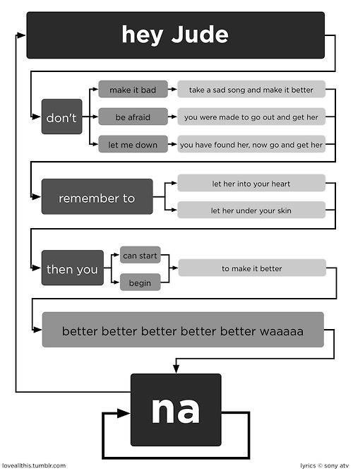

Here are the worked example in-session activities associated with the lecture [here](slides.html)


## 10 Minute Activity - Baby Steps with Strings

Create an R script file (File -> New File -> R Script) and save it as character_data.R in your project directory. After each of the steps below, Source (e.g., hit the source button) the file and look at the output in the console.

1. Define a variables `first_name`, `middle_name`, `last_name` and fill them in with your own data. What happened when you Sourced the file?

```{r}
first_name <- "John"
middle_name <- "Jacob"
last_name <- "Jingleheimer-Schmidt"
```

When you define a variable and `source` a file, it loads the variables into the environment.

&nbsp;

2. List the names of the variables, one on each line (AFTER!!!!!) their definition. What happened after the Source this time?

```{r}
first_name
middle_name
last_name
```

When you source the file that lists the names of the variables, the values the variables are dumpted to the console.


&nbsp;

3. Put them into a variable named me that has them all together using the c() function (like we did for good old Ned) and on the next line put the name of this variable again. What happened after this Source?


```{r}
me <- c(first_name, middle_name, last_name)
me
```

These variables are put into a vector.

&nbsp;

4. Look up the function `paste` in the help files using the command ?paste. If you are given a few options, select the one with the title Concatenate Strings that is provided in the base package.

```{r}
paste( me )
paste( me, collapse = " ")
paste( me, sep = " ")
```


## 15 Minute Activity - String Operations - Your Turn




```{r warning=FALSE}
url <- "https://raw.githubusercontent.com/dyerlab/ENVS-Lectures/master/data/hey_jude.txt"
text <- readLines( url )
text
```

For this, I'm going to remove all the punctuation, make it all lower case and then tabulate the words after I split them into individual entries.

```{r}
library(stringr)
text <- tolower(text) 
text <- gsub("[[:punct:]]","",text)
words <- str_split(text, pattern=" " )[[1]]
frequencies <- table( words )
rev(sort(frequencies))
```

