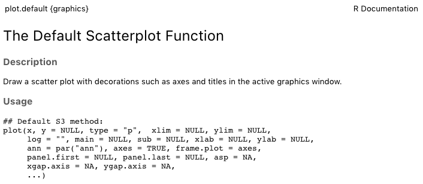
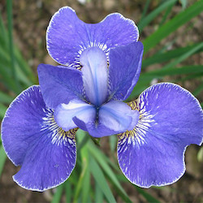

class: left, bottom
background-image: url("images/contour.png")
background-position: right
background-size: auto


```{r setup, include=FALSE}
knitr::opts_chunk$set( fig.retina = 3, 
                       warning = FALSE, 
                       message = FALSE)
library( knitr )
options(knitr.table.format = "html")
library( tidyverse )
library( fontawesome )
library( emo )
library( lubridate )

theme_set( theme_minimal( base_size=16))

read_csv("https://raw.githubusercontent.com/dyerlab/ENVS-Lectures/master/data/deq_data/Field_Data.csv") %>% 
  mutate( Depth = Fdt_Depth, 
          Date = parse_date_time( Fdt_Date_Time, orders="%m/%d/%Y %H:%M", tz="EST"),
          Station = factor(Fdt_Sta_Id, ordered=TRUE),
          Salinity = Fdt_Salinity,
          DO = Fdt_Do_Optical) %>%
  select( Station, Date, Depth, Salinity, DO) -> data 
```


# Visualizing Data


### Making Graphs that .red[Don't] Suck


<p>&nbsp;</p>

<p>&nbsp;</p>


---
class: sectionTitle

# .green[Quick Sidetrack<br/>Into Functions]

## Alright Already, I'm tired of repeating myself.


---

# Tired of Repeating Yourself?  

The number of errors in code is directly proportional to the amount of code you write.  If you find yourself doing the same thing over and over again (like loading the .red[Field_Data.csv] data set), wrap it into a function and each time you need to it, call the function instead of copy-paste or rewriting the same thing over and over again.

&nbsp;

### .center[DRY]


---

# ⚙️ Making Functions

A function is just a *chunk* of code, wrapped within curly brackets, and given a name.


```{r eval=FALSE}

foo <- function() {
  
  # R CODE GOES HERE
  
}

```


--

The contents of a function may be:  

- A few lines of code or hundreds,  

- Calls to other functions,  

- Accepting variables as argument *input* (or not), and 

- Returning some object (or not).


---

# Variable Scope

Variables within a function are 'localized' to within that variable *alone*.  This allows us to:

1. Not run out of variable names (`df` and `x` are common ones we've used thus far).  

2. Not have the variables we are working with being clobbered every time we call another function.


---

Define a function with a variable `x` inside the function.

```{r}
foo <- function() {
  x <- 42
  cat("x = ", x, "within function.\n")
}
```


--

Then examine a similarly named variable with a different assigned value before and after calling that function.

```{r}
x <- 23
cat("x = ", x, "before function call.")
```

--

Within the function, the variable represents the value inside the function.

```{r}
foo()
```

--

And after the function is called, examine the value of the variable.

```{r}
cat("x = ", x, "after function call")
```


.blueinline[NOTICE: before and after function are in "global variable scope, whereas inside the function, the variable is .red[localized] within the boundaries of the function itself."]


---

# Variable Scope

The global scope is shown in RStudio on the *Environment* tab.

.center[]

--

You can also see what is in the environment by asking to list all variables and functions using the `ls()` function.

```{r}
ls()
```


---

# Passing Varibles to A Function

While some functions do not take input variables, many require it.  To pass variables into the function scope, we identify them in the 


```{r}
foo <- function( x ) {
  cat("x =", x, "in the function.")
}
foo( 23 )
```

--

If you do not provide a value for a required variable, it will give you an error.

```{r error=TRUE}
foo()
```


---

# Default Function Variables

We can put in *default* values for arguments by assigning values in the function parentheses.

```{r}
favorite <- function( name = "Garey" ) {
  cat("My favorite DEQ employee is:", name, "\n")
}

favorite()
```

--

But can be overridden when necessary (either named or not)

```{r}
favorite( name = "Jones")
```


---

# Getting Results from Functions

In addition to sending data *to* a function, we often want to get something *back from* a function.  We **must** be explicit about wanting to send something back to the caller using the `return()` function.

```{r}
foo <- function( name = "Alice") {
  response <- paste( name, "is in the house.")
  return( response )
}
```

---

## 15 Minute Activity - Make Your First Function

For this, make a new R script named `getStationData.R` and save it in the same folder as the project.  Do the following.

1. Copy the contents of the previous exercise where you loaded the data in, formatted dates and factors into this function.

2. Take a look at the help file for the function `str_sub()` to see if you can also extract the values from the station Id representing the river distance as a new column of data and use `as.numeric()` to turn it into a number from the string.  You'll want to put his `mutate()` *before* you turn the Station Id from a character into a factor.

3. After you have the code working **exactly** like you want, wrap it into a function.  You will want to:

  a. Give it the same name as the file (one function in each file with the same name keeps things sane).  
  b. Provide a default file name for this case, but if you have other data files of the same format, this function will work just fine.
  
  c. Load the libraries you need to run this function.  Never assume that they are already loaded into memory.
  
  d. At the end of all the piping, assign the data to a variable inside the function.
  
  e. Use the `return()` function to return this value from the function to whomever called it.


---

# General Schematic

The file should look something like this.  Save the file and close the editor.

```{r eval=FALSE}
# this function loads in the default station configuration and formats it
#  for subsequent analyses.

getStationData <- function(filename = "Field_Data.csv") { 
  library( tidyverse )
  library( lubridate )
  read_csv( filename ) %>%
    ...
    mutate( Distance = as.numeric( str_sub( Fdt_Sta_Id, 6, 11) ) ) %>%
    ...
    select( ... ) -> data  
  
  return( data )
}
```


---

# Using Your Function

To use the file, you do the same thing that `RStudio` does when you hit the `source` button.  Let's verify.

1. Select `Session -> Restart R & Clear Output`  

2. In the console, type `source("getStationData.R")`.   Since this is a user defined function, it must be sourced each time you start a session or after you clear all the variables from memory.  You can set these to be loaded by default if you like.

3. Take a look at your `Environment` tab and you should see your function named there.

4. Call the function now like any other function.

```{r eval=FALSE}
data <- getStationData.R()
```

and you should have your data! .green[Congratulations!]


---
class: sectionTitle

# .red[Basic Graphics]

---

# R has Built-In Graphics

That are really good for quick visualizations.  However, they are limited and we will not spend much time on them.

&nbsp;

.center[  ]


---

# Some Examples - Univariate Data

.pull-left[
For the classic graphics, we do not pipe data in but instead use the older `$` notation.  Here is a histogram function for the Depth (n.b., in my function it renamed `Fdt_Depth` to `Depth`)

```{r eval=FALSE}
hist( data$Depth )
```

]

.pull-right[
```{r echo=FALSE}
hist( data$Depth )
```
]
---

# Some Examples - Univariate Data

.pull-left[

We can customize the labels (they just us the name of the data column)

```{r eval=FALSE}
hist( data$Depth, 
      xlab="Water Depth (m)", 
      ylab="Frequency", main="" )
```
]

.pull-right[

&nbsp;

```{r echo=FALSE}
hist( data$Depth, xlab="Water Depth (m)", ylab="Frequency", main="" )
```
]
---

# Density Plots

.pull-left[

You can derive the probability density of some observed data using the `density()` function, which knows how to plot itself.

```{r eval=FALSE}
d <- density( data$Depth )
plot( d )
```

]

.pull-right[
```{r echo=FALSE}
d <- density( data$Depth )
plot( d )
```

]

---

# Scatter Plots


.pull-left[
Here the plot takes data as (x,y) for the respective axes.  By default, it will use the column names as the axis labels and the range of data for the size limits.  They can individually be customized by passing additional arguments to the `plot()` function.

&nbsp;

```{r eval=FALSE}
plot( data$Depth, data$Salinity,
      xlab="Depth", ylab="Salinity" )
```
]

.pull-right[ 
```{r echo=FALSE}
plot( data$Depth, data$Salinity,
      xlab="Depth", ylab="Salinity" )
```
]


---

# `plot()` Options

Parameter | Description
----------|-----------------------------------------------------------------------------------------------------------
`type`    | The kind of plot to show ('p'oint, 'l'ine, 'b'oth, or 'o'ver).  A point plot is the default.
`pch`     | The character (or symbol) being used to plot.  There 26 recognized general characters to use for plotting.  The default is `pch=1`. 
`col`     | The color of the symbols/lines that are plot.
`cex`     | The magnification size of the character being plot.  The default is `cex=1` and deviation from that will increase (cex > 1) or decrease (0 < cex < 1) the scaling of the symbols.  Also works for `cex.lab` and `cex.axis`.
`lwd`     | The width of any lines in the plot.
`lty`     | The type of line to be plot (solid, dashed, etc.)
`bty`     | The 'Box' type around the plot ("o", "1", "7","c","u", "]", and my favorite "n")


---

```{r echo=FALSE}
par(mar=c(3,3,3,3))
num <- 0 ; 
num1 <- 0
plot(0,0 , xlim=c(0,21) , ylim=c(0.5,6.5), col="white" , yaxt="n" , ylab="Parameter" , xlab="", bty="n", cex.axis=1.5 )

for (i in seq(1,20)){
   points(i,1 , pch=i , cex=3)
   points(i,2 , col=i , pch=16 , cex=3)
   points(i,3 , col="black" , pch=16 , cex=i*0.25)
   if(i %in% c(seq(1,18,3))){
      num=num+1
      points(c(i,i+2), c(4,4) , col="black" , lty=num , type="l" , lwd=2)
      text(i+1.1 , 4.25 , num, cex=1.5)
   }
   
   if(i %in% c(seq(1,20,5))){
      num1=num1+1
      points(c(i,i+1,i+2,i+3), c(5,5,5,5) , col="black"  , type=c("p","l","b","o")[num1] , lwd=2)
      text(i+1.5 , 5.3 , c("p","l","b","o")[num1], cex=1.5 )
      points(c(i,i+1,i+2,i+3), c(6,6,6,6) , col="black"  , type="l",  lwd=num1)
      text(i+1.5 , 6.25 , num1, cex=1.5 )
      
   }
}

axis(2, at = c(1,2,3,4,5,6), 
     labels = c("pch" , "col" , "cex" , "lty", "type" , "lwd" ), 
     tick = TRUE, 
     col = "black", 
     las = 1, cex.axis=1.25)
```


---

# Boxplots

.pull-left[
For bi-variate data, we can use either the (x,y) coordinate notation **or** a *functional* notation where it is denoted as y ~ x (like a regression model).  Here is that example using `boxplot()` for depths by staion (and I factored out the data as well into a `data=` argument for increased clarity).

&nbsp;

```{r eval=FALSE}
boxplot( Depth ~ Station, data= data,
         notch=TRUE, xlab="Station")
```
]

.pull-right[
```{r echo=FALSE}
boxplot( Depth ~ Station, data= data,
         notch=TRUE, xlab="Station")
```
]


---

# Line Plots


.pull-left[
Line plots are the same as scatter ones, we just need to tell it to use `type='l'` and make sure that we have the .red[data ordered by station] for grouping so it makes lines from one point to the next in the right order or groups.  If not, it looks a bit *scattered*

&nbsp;

```{r eval=FALSE}
plot( data$Depth, data$Salinity, 
      type="l", 
      xlab="Depth", ylab="Salinity")
```
]

.pull-right[ 
```{r echo=FALSE}
plot( data$Depth, data$Salinity, 
      type="l", 
      xlab="Depth", ylab="Salinity")
```
]


---

## 15 Minute Activity - Some Scatter Plots

Create a new R file named `basic_visualization.R` in the same directory as the Project.  In this file, `source("getSationData.R")` and make an example plot using the data of your choice for the following graphic output types.  Feel free to snazz it up with color (col="red" or col=3), plot character (pch=#), size (cex=#), etc.

1. A histogram 

2. A scatter plot 

3. A boxplot


---
class: sectionTitle

# .orange[GGPlot]


### The Grammar of Graphics


---

# The Grammar of Graphics


.pull-left[ Components of graphics:

- Data  

- Aesthetics  

- Transformations  

- Partitions  

- Auxillary Text 

- Overlays
]

.pull-right[ 

]


---

# The `ggplot2` Library

.pull-left[

]


.pull-right[
  ### R Packages for Data Science
  
  - RStudio + Hadley Wickham
  
  - Collection of Packages
  
  - Makes you .red[AWESOME]
  
```{r}
library( ggplot2 )
```

  - Included by default with `tidyverse`
]


---

.pull-left[
# GGPlot function

Calling the `ggplot()` function creats the base of the graph.  After that, you literally add (using the + operator) the other components to it.

```{r eval=FALSE}
data %>%
  ggplot() 
```
]

.pull-left[

&nbsp;

&nbsp;

```{r echo=FALSE}
data %>%
  ggplot() 
```
]

---

# Inserting Data

Data can be inserted into different places in plots **and** multiple data frames may be used to make the graphic.

Both of these are equally valid.

```{r eval=FALSE}
data %>% ggplot() 
```

or 

```{r eval=FALSE}
ggplot( data ) 
```

as well as some other configurations we will touch on later.

---

# Aesthetics

The aesthetics provide information on data representation.  If an entity of the graphic is taken from a value within a `data.frame`, then it needs to be specified in the aesthetics.  It is accomplished by passing variable names to the function `aes()`

--

- `aes()` as argument to `ggplot()`: Data mapping is inherited downstream

```{r eval=FALSE}
data %>%
  ggplot( aes(x=Depth, y=Salinity) )
```


- `aes()` as argument to subsequent layers: Mapping only for that layer.


---

.pull-left[
# Geometric Layers

Everything .red[after] `ggpot()` is added (.red[+]) to the plot.  Here is a geometric layer that estimates the density of the data.
```{r eval=FALSE}
data %>%
  ggplot( aes(x=Depth) ) + 
  geom_density() 
```
]

.pull-right[

&nbsp;

&nbsp;

```{r echo=FALSE}
data %>%
  ggplot( aes(x=Depth) ) + 
  geom_density() 
```
]


---

.pull-left[
# Point Data

Notice how we can omit the x=, y= if we 

```{r eval=FALSE}
data %>%
  ggplot( aes(Depth, Salinity) ) + 
  geom_point() 
```
]

.pull-right[

&nbsp;

&nbsp;

```{r echo=FALSE}
data %>%
  ggplot( aes(Depth, Salinity) ) + 
  geom_point() 
```
]


---

.pull-left[
# Grouping

Grouping of points by station is denoted by adding that to the `aes()` (since it pulls the values from the data itself rather than being set for all the data)

```{r eval=FALSE}
data %>%
  ggplot( aes(Depth, Salinity, color=Station) ) + 
  geom_point() 
```


]

.pull-right[

&nbsp;

&nbsp;

```{r echo=FALSE}
data %>%
  ggplot( aes(Depth, Salinity, color=Station) ) + 
  geom_point() 
```
]


---

.pull-left[
# Grouping

Grouping of points by station is denoted by adding that to the `aes()` (since it pulls the values from the data itself rather than being set for all the data)

```{r eval=FALSE}
data %>%
  ggplot( aes(Depth, Salinity, color=Station) ) + 
  geom_point() 
```

or 

```{r eval = FALSE}
data %>%
  ggplot( aes(Depth, Salinity) ) + 
  geom_point( aes(color=Station) ) 
```

or 

```{r eval = FALSE}
ggplot() + 
  geom_point( aes(Depth, 
                  Salinity, 
                  color=Station), 
              data = data ) 
```


]

.pull-right[

&nbsp;

&nbsp;

```{r echo=FALSE}
data %>%
  ggplot( aes(Depth, Salinity, color=Station) ) + 
  geom_point() 
```
]

---

.pull-left[
# Iterative Creation

Since a graphic is just a collection of function calls, we can create them iterative.

```{r}
p <- ggplot( data, aes(Depth,Salinity) ) + geom_point()
```

Then when we want to plot it we can call

```{r eval=FALSE}
p
```
]

.pull-right[

&nbsp;

```{r echo=FALSE}
p
```

]

---

# Theme Layers

The theme layers control the appearance of components of the graph such as colors, fonts, etc.

- Themes are customization, 

- Can set a default theme for a document,

- Come with built-in varieties.

&nbsp;

&nbsp;

Here are some examples.

---

```{r}
p + theme_bw()
```


---

```{r}
p + theme_gray()
```

---

```{r}
p + theme_dark()
```

---

```{r}
p + theme_linedraw()
```

---

```{r}
p + theme_classic()
```

---

```{r}
p + theme_void()
```


---

# A Slightly Different Dataset

I'm going to switch to a built-in data set that has more samples per factor level to show a few more features.

.pull-left[

]

.pull-right[
```{r}
summary( iris )
```
]


---

.pull-left[ 
# Histograms

```{r eval=FALSE}
ggplot( iris, aes( x = Sepal.Length) ) + 
  geom_histogram()
```
]

.pull-right[

&nbsp;

```{r echo=FALSE}
ggplot( iris, aes( x = Sepal.Length) ) + 
  geom_histogram()
```
]


---

.pull-left[ 
# Boxplots

```{r eval=FALSE}
ggplot( iris, aes( x = Sepal.Length) ) + 
  geom_boxplot( notch=TRUE )
```
]

.pull-right[

&nbsp;

```{r echo=FALSE}
ggplot( iris, aes( x = Sepal.Length) ) + 
  geom_boxplot( notch=TRUE )
```
]


---

.pull-left[ 
# Distributions

```{r eval=FALSE}
ggplot( iris, aes(x=Species, y=Sepal.Length) )  + 
  geom_boxplot( notch=TRUE )
```
]

.pull-right[

&nbsp;

```{r echo=FALSE}
ggplot( iris, aes(x=Species, y=Sepal.Length) )  + 
  geom_boxplot( notch=TRUE )
```
]


---

.pull-left[ 
# Fixed Colors

```{r eval=FALSE}
ggplot( iris, aes(x=Species, y=Sepal.Length) )  + 
  geom_boxplot( notch=TRUE, fill=c("blue") ) +
  ylab("Sepal Length")
```
]

.pull-right[

&nbsp;

```{r echo=FALSE}
ggplot( iris, aes(x=Species, y=Sepal.Length) )  + 
  geom_boxplot( notch=TRUE, fill=c("blue") ) +
  ylab("Sepal Length")
```
]


---

.pull-left[ 
# Data Colors

```{r eval=FALSE}
ggplot( iris, aes( x=Species, 
                   y=Sepal.Length,
                   fill=Species) )  + 
  geom_boxplot( notch=TRUE )  +
  ylab("Sepal Length")
```
]

.pull-right[

&nbsp;

```{r echo=FALSE}
ggplot( iris, aes( x=Species, 
                   y=Sepal.Length,
                   fill=Species) )  + 
  geom_boxplot( notch=TRUE )  +
  ylab("Sepal Length")
```
]


---

.pull-left[ 
# Fixed Colors

```{r eval=FALSE}
ggplot( iris, aes( x=Species, 
                   y=Sepal.Length) )  + 
  geom_boxplot( notch=TRUE, 
                fill=c("#002145", 
                       "#a5acaf",
                       "#66c010") ) +
  ylab("Sepal Length")
```
]

.pull-right[

&nbsp;

```{r echo=FALSE}
ggplot( iris, aes(x=Species, y=Sepal.Length) )  + 
  geom_boxplot( notch=TRUE, fill=c("#002145", "#a5acaf","#66c010") ) +
  ylab("Sepal Length")
```
]


---

class: sectionTitle

# GGPLot Overlays


---

.pull-left[
# Trendlines

```{r eval=FALSE}
ggplot( iris, aes( x = Sepal.Length, y = Sepal.Width) ) + 
  geom_point()  + 
  stat_smooth()
```
]

.pull-right[
```{r echo=FALSE}
ggplot( iris, aes( x = Sepal.Length, y = Sepal.Width) ) + 
  geom_point()  + 
  stat_smooth()
```
]

---

.pull-left[

# Trendline

You can specify the equation and the model that make the overlay of the statistic as arguments to that layer.

```{r eval=FALSE}
ggplot( iris, aes( x = Sepal.Length, y = Sepal.Width) ) + 
  geom_point()  + 
  stat_smooth( method="lm", formula = "y ~ x")
```
]

.pull-right[

&nbsp;
```{r echo=FALSE}
ggplot( iris, aes( x = Sepal.Length, y = Sepal.Width) ) + 
  geom_point()  + 
  stat_smooth( method="lm", formula = "y ~ x")
```

]


---
.pull-left[
# Stacking Order 

```{r eval=FALSE}
ggplot( iris, aes( x = Sepal.Length, y = Sepal.Width) ) + 
  geom_point( color="red")  + 
  stat_smooth( fill="black", alpha=1)
```
]

.pull-right[

&nbsp;
```{r echo=FALSE}
ggplot( iris, aes( x = Sepal.Length, y = Sepal.Width) ) + 
  geom_point( color="red")  + 
  stat_smooth( fill="black", alpha=1)
```

]


---
.pull-left[
# Stacking Order 

```{r eval=FALSE}
ggplot( iris, aes( x = Sepal.Length, y = Sepal.Width) ) + 
  stat_smooth( fill="black", alpha=1) + 
  geom_point( color="red")  
```
]

.pull-right[

&nbsp;
```{r echo=FALSE}
ggplot( iris, aes( x = Sepal.Length, y = Sepal.Width) ) + 
  stat_smooth( fill="black", alpha=1) + 
  geom_point( color="red")  
```

]


---

.pull-left[
# On-The-Fly Transformations

Customizing the y-axis data format...


```{r eval=FALSE}
ggplot( iris, aes(x = Sepal.Length) ) + 
  geom_histogram( aes( y = ..density.. ), 
                  color="green", 
                  fill="orange", bins = 15 ) + 
  geom_density( color = "magenta", lwd=1.5 )  
```
]

.pull-right[

&nbsp;
```{r echo=FALSE}
ggplot( iris, aes(x = Sepal.Length) ) + 
  geom_histogram( aes( y = ..density.. ), 
                  color="green", 
                  fill="orange", bins = 15 ) + 
  geom_density( color = "magenta", lwd=1.5 )  
```

]

---

# Textual Overlays

```{r}
cor_model <- cor.test( iris$Sepal.Length, iris$Sepal.Width)
cor_model
```

--

```{r}
names( cor_model ) 
```


---

# Formatting as Text

Lets use paste to grab some of that information from the corrleation analysis and make it into a text object we can add as a layer over the plots.

```{r}
cor.text <- paste( "r = ", 
                   format( cor_model$estimate, digits=4), 
                   ";\n P = ", 
                   format( cor_model$p.value, digits=4 ), 
                   sep="" ) 
cor.text
```


---
.pull-left[

I'm going to manually locate the x and y location for the text overlay within the `aes()` call nested within `geom_text()` so that it overrides the default x- and y- values passed through the `aes()` upstream.

```{r eval=FALSE}
p + geom_text( aes(x=7.25, y=4.25, 
                   label=cor.text) )
```
]

.pull-right[

&nbsp;

```{r echo=FALSE}
p + geom_text( aes(x=7.25, y=4.25, label=cor.text) )
```

]


---

# Labels

So let's make another source of data that has the mean width and length of sepals for each species.

```{r}
iris %>%
  group_by( Species ) %>%
  summarize( Sepal.Length = mean(Sepal.Length),
             Sepal.Width = mean( Sepal.Width ) ) -> df

df
```


---
.pull-left[
# Labels

```{r eval=FALSE}
ggplot( iris, aes(Sepal.Length, Sepal.Width) ) + 
  geom_point( aes(color=Species) ) + 
  geom_text( aes(label=Species), data=df) + 
  xlab("Sepal Length (mm)") + 
  ylab("Sepal Width (mm)")
```
]

.pull-right[

&nbsp;
```{r echo=FALSE}
ggplot( iris, aes(Sepal.Length, Sepal.Width) ) + 
  geom_point( aes(color=Species) ) + 
  geom_text( aes(label=Species), data=df) + 
  xlab("Sepal Length (mm)") + ylab("Sepal Width (mm)")
```

]


---

# Smart Labels

```{r}
library( ggrepel )
```


---
.pull-left[

# Adding Labels
```{r eval=FALSE}
ggplot( iris, aes(Sepal.Length, Sepal.Width) ) + 
  geom_point( aes(color=Species) ) + 
  geom_label_repel( aes(label=Species), data=df ) + 
  xlab("Sepal Length (mm)") + 
  ylab("Sepal Width (mm)")
```
]

.pull-right[

&nbsp;
```{r echo=FALSE}
ggplot( iris, aes(Sepal.Length, Sepal.Width) ) + 
  geom_point( aes(color=Species) ) + 
  geom_label_repel( aes(label=Species), data=df )+ 
  xlab("Sepal Length (mm)") + ylab("Sepal Width (mm)")
```

]


---
.pull-left[
# Remove Legend 

```{r eval=FALSE}
ggplot( iris, aes(Sepal.Length, Sepal.Width) ) + 
  geom_point( aes(color=Species) ) + 
  geom_label_repel( aes(label=Species), data=df ) + 
  guides( color = FALSE ) + 
  xlab("Sepal Length (mm)") + 
  ylab("Sepal Width (mm)")
```
]

.pull-right[

&nbsp;
```{r echo=FALSE}
ggplot( iris, aes(Sepal.Length, Sepal.Width) ) + 
  geom_point( aes(color=Species) ) + 
  geom_label_repel( aes(label=Species), data=df ) + 
  guides( color = FALSE ) + 
  xlab("Sepal Length (mm)") + ylab("Sepal Width (mm)")
```

]


---

# 15 Minute Activity - GGPlot Station Data

Make a new R script file in the same folder as the Project and name it `ggplot_practice.R`  In it, do the following.

1. Use `source("getStationData.R")` to load in the data an call the function.  

2. Create a histogram of depths.

3. Look at the help file for `facet_grid()` to see what it does.  Now, take the data and group it by weekday (in the mutate, name the new column `Weekday`) and make a histogram of the Depths.  But this time add `+ facet_grid( .~Weekday)`.

4. Use the same data as the previous question but this time use use `geom_histogram( aes(fill=Weekday), alpha=0.75)` instead of the previous empty `geom_histogram()`.  Which do you think is more interpretative?

5. Make a scatterplot (`geom_point()`) using Date as the independent variable and Salinity as the dependent one.  

6. Allow ggplot to overlay a trend line of dissolved oxygen as a function of depth.  The default model for this overlay trend line is a loess regression.  If you are knowledgeable about regression models, what may be a more appropriate model to use?


---

class: middle
background-image: url("images/contour.png")
background-position: right
background-size: auto

# Questions?

.center[


]


