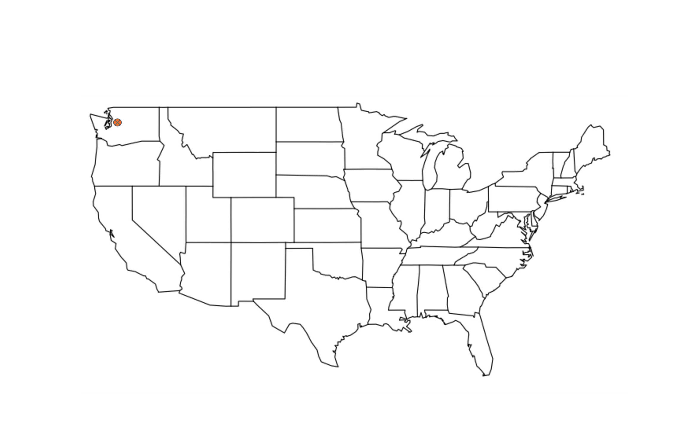
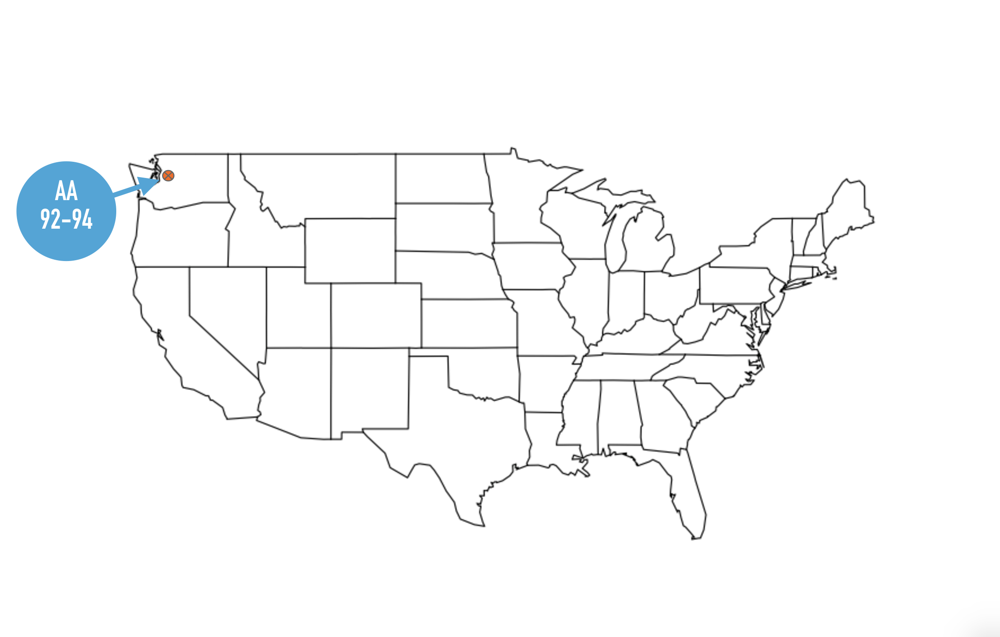
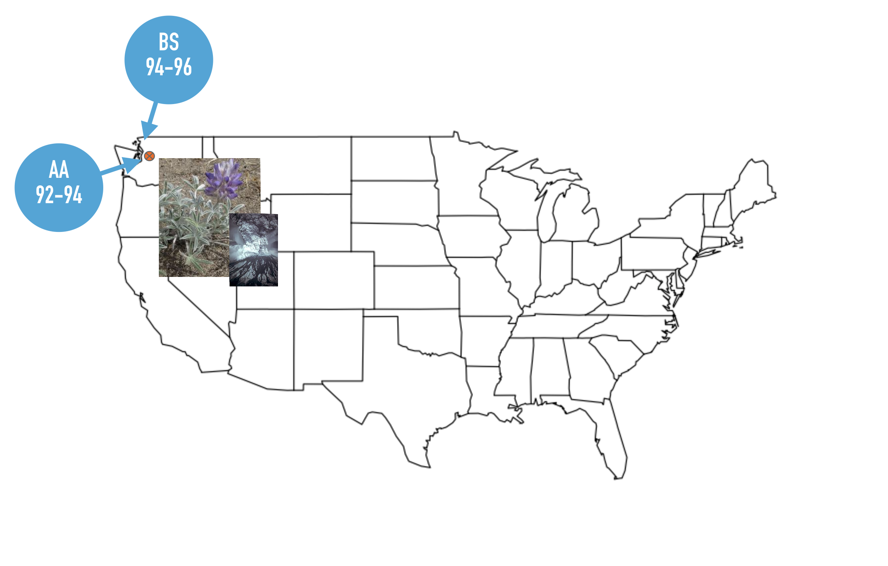
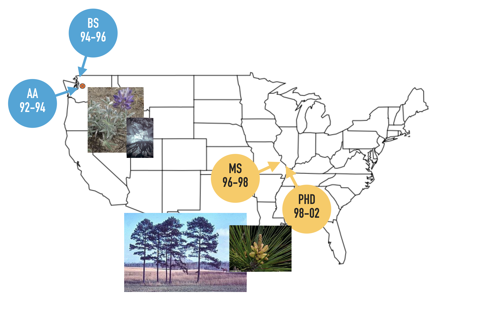
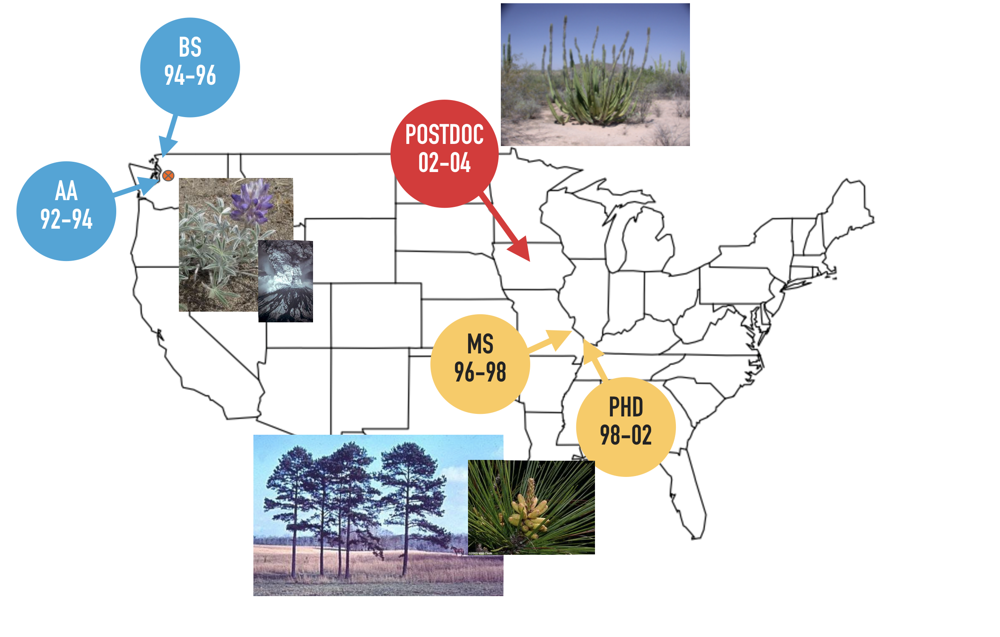
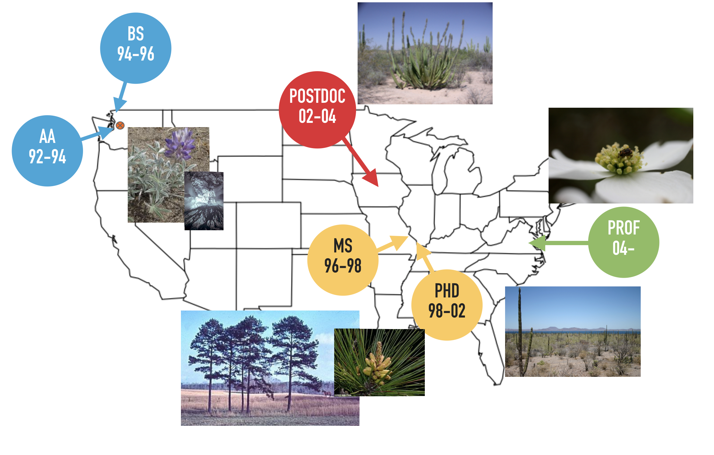
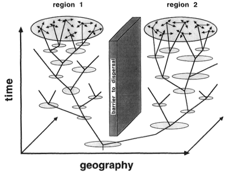

```{r setup, include=FALSE}
knitr::opts_chunk$set(echo = FALSE)
```

# Roadmap 

- The "Origin Story"  

- Research: Inquiry into Historical & Contemporary Processes  

- Environmental Studies *writ large* & *sensu stricto*


---
class: inverse, center, middle

# Dyer

---
class: center, middle

```{r}

```


---
class: center, middle

```{r}

```


---
class: center, middle

```{r}

```


---
class: center, middle

```{r}

```


---
class: center, middle

```{r}

```


---
class: center, middle

```{r}

```


---
class: inverse, center, middle

# Research Questions


---
background-image: url(./GeneFlow.png)
background-size: cover


---
background-image: url(./Stratigraphy.png)
background-size: contain
background-color: #000000


---
background-image: url(./HistoricalProcesses.png)
background-size: contain
background-color: #000000


---

# Consequences of Barriers

.pull-left[

```{r}

```
Avise (2000)
]

.pull-right[
> The two key steps of landscape genetics are: 
> 
>   - the detection of **Genetic Discontinuities**, and 
> 
>   - the correlation of these discontinuities with **Landscape and Environmental Features** such as barriers.
]


---
background-image: url(./BajaCalifornia.png)
background-size: cover


---
background-image: url(./Coalescent1.png)
background-size: cover


---
background-image: url(./Coalescent2.png)
background-size: cover


---
background-image: url(./RangeExpansion.png)
background-size: contain
background-color: #000000


---
background-image: url(./Araptus.png)
background-size: contain


---
background-image: url(./AraptusStructure.png)
background-size: contain
background-color: #000000

---
background-image: url(./ContemporaryHistorical.png)
background-size: contain


---
background-image: url(./Contemporary.png)
background-size: contain
background-color: #000000


---
background-image: url(./Dogwood.png)
background-size: contain
background-color: #000000


---
background-image: url(./InterveningHabitat.png)
background-size: contain
background-color: #000000

---
background-image: url(./EcologicalNeighborhoods.png)
background-size: contain
background-color: #000000

---
background-image: url(./CultivarImpacts.png)
background-size: contain


---
background-image: url(./CultivarNative.png)
background-size: contain
background-color: #000000


---
class: inverse, center, middle

# ENVS Program


---

# New People, Vision, & Directions

*Historically:* This program was an extension of the BS in Biology.  

--

*Realistically:* An Environmental Scientist is **much more** than a biologist.


---

# Why a BS in Environmenal Studies

The goal of the Bachelor of Science (B.S.) degree program in Environmental Studies is to provide an interdisciplinary undergraduate degree program that emphasizes the critical links between environmental life sciences and public policy. 

--

This goal necessitates training that crosses disciplinary boundaries. Through a program of study combining **environmental science**, **environmental technology**, and **environmental policy**, the successful graduate will gain a range of skills designed to facilitate a science-based understanding of the natural world and human interactions with it. 

--

The B.S. is specifically designed to provide students with professional training to prepare them for careers in the application of environmental science and policy.


---

# Program-Level Learning Outcomes

Upon completing this program, students will be able to demonstrate the following:  

- Relate the principles and interconnections of environmental science and policy  
- Demonstrate the ability to use basic environmental skills within the research processes  
- Demonstrate a knowledge of basic biological concepts and their integration  
- Demonstrate a knowledge of basic ecological concepts and integration  
- Demonstrate a knowledge of basic earth science concepts and their integration  


---
background-image: url(./Bloom.png)
background-size: contain
background-color: #ebebeb

---
background-image: url(./Skill1.png)
background-size: contain


---
background-image: url(./Skill2.png)
background-size: contain


---
background-image: url(./Skill3.png)
background-size: contain


---
background-image: url(./Skill4.png)
background-size: contain


---
background-image: url(./WholeEnchalada.png)
background-size: contain


